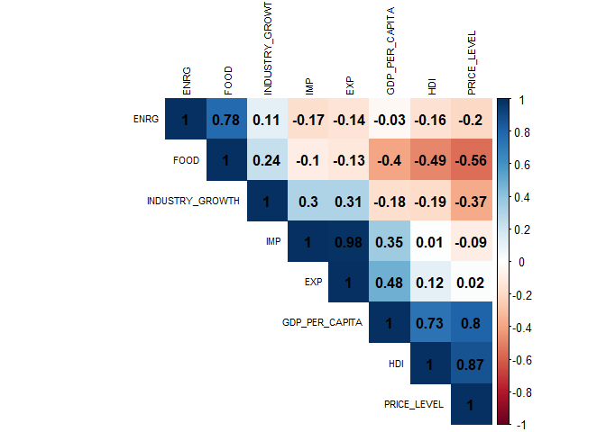

# Effects of economic growth on CO2 emissions

*NTU – Department of Oceanography*

***Nathanaël Lahary***

- Graduate Institute of Oceanography,
- National Taïwan Univeristy, No. 1, Sec. 4, Roosevelt Rd., Taipei
  106319, Taiwan (R.O.C.)
- Correspondence: <nathanaellahary@gmail.com>

Published: December 2023

------------------------------------------------------------------------

## Abstract

This study investigates the relationship between economic growth and CO2
emissions, challenging the historical assumption that increased
prosperity directly leads to higher carbon emissions. Analyzing global
CO2 per capita data for 2021, we observe diverse emission patterns
across countries, revealing a nuanced interplay between wealth and
environmental responsibility. Employing k-means clustering and principal
component analysis, we identify distinct economic profiles and outlier
nations such as Ireland, Luxembourg, Turkey, and Colombia. Pearson
correlation coefficients further highlight varying impacts of economic
indicators on CO2 emissions for selected countries. Notably, some
nations demonstrate a decoupling of economic growth and carbon
emissions, emphasizing the importance of sustainable development
strategies.

> Keywords: GDP per Capita, CO2 per Capita, CO2 emissions, economic
> growth,

## Introduction

In recent centuries, it was widely accepted that a country’s economic
growth was inextricably linked to the increase in its carbon dioxide
(CO2) emissions. A direct relationship was established: the more
prosperous a country became, the more its CO2 emissions increased,
mainly due to the dependence on burning fossil fuels for energy
production. However, since the 1990s, with the advent of nuclear and
other alternative energy sources, many countries have managed to reduce
their greenhouse gas emissions while maintaining sustained economic
growth. This transition has accelerated over time, marked by the shift
from carbon-intensive industries to the service sector, as well as the
gradual substitution of fossil fuels for more sustainable and
economically viable alternatives. This reflects a significant
transformation in how countries reconcile economic growth and
environmental responsibility.

We represented carbon emissions per capita globally in 2021, using data
from the International Energy Agency. CO2 figures are expressed in
tonnes per capita and refer to direct gross emissions from energy
combustion only. Thus, carbon emissions from imports are not considered.
We can make a first observation on a possible influence of the wealth of
the population on CO2 emissions, indeed most of the countries of Africa
which are among the least rich countries of the world emit less than 1
ton of CO2 per capita. At the extreme opposite of the Middle East
countries can individually group more emissions than the whole of those
from Africa. Among them are Kuwait, United Arab Emirates and Qatar,
which holds the record with 31.69 tons of CO2 per capita in 2021.
Conversely, other nations manage to keep emissions levels relatively
low, sometimes around the global average of around 4 tonnes per person.
These countries often adopt policies focused on renewable energy,
reducing dependence on fossil fuels, and promoting energy efficiency.
This is particularly the case in some European countries such as France,
Switzerland, Denmark, or the United Kingdom.

    ## Reading layer `World_Countries_Generalized' from data source 
    ##   `C:\Users\natha\Desktop\T12508101_Final_Project\geo_data\World_Countries_Generalized.shp' 
    ##   using driver `ESRI Shapefile'
    ## Simple feature collection with 251 features and 7 fields
    ## Geometry type: MULTIPOLYGON
    ## Dimension:     XY
    ## Bounding box:  xmin: -180 ymin: -89 xmax: 180 ymax: 83.6236
    ## Geodetic CRS:  WGS 84

To best illustrate the influence of a country’s wealth on these
emissions we have plotted the GDP per Capita according to CO2 emissions
per capita using a log scale. Countries are represented by points whose
size increases in proportion to the country’s GDP. There are a
significant number of countries with low economies that emit very little
CO2, represented by the mass of blue dots. Moreover, we can observe that
most countries in the world emit less than 10 tons of CO2 per capita,
while 4 countries emit more than 20 tons.

Finally, the most interesting observation is that many countries have a
very large GDP per capita while maintaining a very low CO2 emission per
capita \< 5 tonnes/capita. If we draw a line at the level of Qatar, we
can count 8 countries with GDP per capita higher than 66,838 dollars per
capita at emissions \< 15 tons per capita. These include Switzerland,
Denmark and Iceland which have emissions below 5 t/hab, Ireland emits
6.71 t/hab, Norway 6.69 t/hab, and finally Luxembourg and the USA which
emit more than 10 t/hab.

Finally, we can illustrate over a longer period of time the evolution of
GDP per capita and CO2 per capita for some countries and report the
trend in the early 2000s of economic growth in some countries. The
graphs show the percentage change over 1990. In the early 2000s,
countries such as France, the United Kingdom and Germany experienced a
very significant increase in GDP per capita, almost doubling the initial
value in 1990, or even multiplying by 4 for Luxembourg. Countries such
as Turkey and Saudi Arabia, which are also experiencing this boom, are
unable to reconcile it with lower carbon emissions.

    ## [[1]]

    ## 
    ## [[2]]

    ## 
    ## [[3]]

    ## 
    ## [[4]]

    ## 
    ## [[5]]

    ## 
    ## [[6]]

## Meterials and Methods

In this study we will use several indicators of economic development to
explain a potential link with CO2 emissions.

- CO2 PER CAPITA: CO2 refers to gross direct emissions from fuel
  combustion only, expressed in tonnes per Capita.

The goal is for these indicators to be relevant enough to explain a
country’s economic growth. The list of economic factors used are:

- GDP PER CAPITA (GDP_PER_CAPITA): GDP per capita in current dollar.

- IMPORTS (IMP) & EXPORTS (EXP): Import and export of goods and services
  between residents and non-residents expressed as % of GDP.

- HDI (HDI): Human development index expressed by a score between 0 and
  1.

- FOOD (FOOD) & ENERGY (ENRG) INFLATION: Food and energy inflation as
  measured by the Consumer Price Index (CPI) expressed as an index.

- INDUSTRIAL PRODUCTION (INDUSTRY_GROWTH): Production of industrial
  entities and covers sectors such as mining, manufacturing,
  electricity, gas and water and air conditioning. Expressed as “an
  index that expresses changes in production volume over a reference
  period.”

- PRICE LEVEL INDEX (PRICE_LEVEL): Ratios of purchasing power parities
  to market exchange rates. The selection of these indices resulted in a
  significant reduction in the number of countries in which the study
  was conducted, due to the unavailability of data for the missing
  countries. The first stage of the analysis was therefore carried out
  on a total of 35 countries.

The first part of our analysis is to assess the similarity of countries’
economic profiles in 2021. To this end, we applied the k-means algorithm
to cluster countries according to several economic indicators. To do so,
we standardized these indicators to ensure comparable scales, then used
a Bartlett test to see if our data are suitable for a technical data
reduction like PCA that we used. Finally, the Average Silhouette method
allowed us to determine the optimal number of clusters.

Then we chose countries belonging to the same cluster and analyzed for
each of them the importance or not of these economic indicators on CO2
emissions per capita. We have chosen to study the influence over the
widest possible period from 2021, which may vary from country to
country. We looked at the correlations between the different indicators
and finally concluded on the impact of economic growth on CO2 emissions
for the selected countries.

## Results

The correlation matrix of standardized indicators shows a strong
positive correlation (\> 80%) between the price level index and the
human development index as well as per capita GDP. The result is not
surprising since the HDI is an indicator obtained by considering the
purchasing power of the inhabitants. Thus, for the 35 countries studied,
it seems that the financial capacity of their inhabitants is strongly
linked to market exchange rates.

Inflation in energy and food prices seems to be proportional from one
country to another, the same for the share of imports and exports in
relation to the country’s GDP.

Finally, if the level of food inflation in a country is high, the price
level index seems to decrease.

The Bartlett test on the matrix gives a p-value of 9.31886e-49, we can
then reject the null hypothesis that it is like an identity matrix, i.e
the variables are not correlated. So, the eight indicators in our
dataset are fairly correlated so a PCA would not have a hard time
compressing these variables into linear combinations that are able to
capture significant variance present in the data.

    ## $chisq
    ## [1] 307.1494
    ## 
    ## $p.value
    ## [1] 9.31886e-49
    ## 
    ## $df
    ## [1] 28

The eigenvalues of the matrix and their respective proportion indicate
that the first two main components would explain 69.2% of the variance
of our data, We considered it to be a significant part to represent most
of the variability of economic indicators across countries.

Then we need to determine the optimal cluster number for our data. Here
the average silhouette method indicates that the appropriate choice
would be 4 clusters.

We then applied principal component analysis (PCA) to reduce the
dimensionality of our data and visualize the clustering structure using
the Kmeans algorithm. The ellipses surrounding the points represent 95%
confidence intervals for each cluster, with filled ones based on
Euclidean distance, and dotted contours based on a multivariate normal
distribution.

Among the 35 countries studied, 4 countries differ drastically from the
rest: Ireland, Luxembourg, Turkey and Colombia. The latter two have a
pronounced negative value for the first main component. Using the table
of scores for each variable for PC1 and PC2, it is observed that HDI,
GDP per Capita and the Price Level Index contribute significantly
positively to PC1. Thus, one can think that Turkey and Colombia are
countries where the wealth of the inhabitants is extremely less compared
to those of Ireland and Luxembourg.

Luxembourg and Ireland have a high PC1 and PC 2 value, indicating that
the inhabitants of these countries have a very high purchasing power,
and that a lot of money grows through the exchange of goods and services
with other countries, between residents and non-residents. The
significance of the value of international trade as a percentage of GDP
between residents and non-residents is very complex and is not detailed
in this work.

|                   | PC1     | PC2      |
|-------------------|---------|----------|
| ENERGY INFLATION  | -0.6626 | -0.02112 |
| FOOD INFLATION    | -1.0872 | 0.18900  |
| EXPORTATION       | 0.5552  | 1.29941  |
| IMPORTATION       | 0.4202  | 1.32767  |
| HDI               | 1.2037  | -0.29810 |
| INDUSTRY GROWTH   | -0.4111 | 0.85594  |
| PRICE LEVEL INDEX | 1.2552  | -0.50044 |
| GDP PER CAPITA    | 1.2307  | 0.20400  |

The first red cluster is composed of Latvia, Poland, Hungary, Czech
Republic, Estonia, Lithuania, Slovenia, and Slovakia in an Euclidean
distance, Belgium, Chile and Greece still following a normal
distribution with the countries within. Apart from Chile, all these
countries belong to Europe and share a certain geographical proximity,
especially for the countries in the Euclidean ellipse.

For the second green cluster, we observe that Switzerland stands out
significantly from the group to the point of almost belonging to the
blue cluster. The result indicates that Switzerland seems to be a
country where the population is in a comfortable economic situation, as
may be the inhabitants of Ireland or Luxembourg. But its limited
attachment to the green cluster shows that trade with other countries is
not a significant part of its GDP.

The countries of the green cluster generally seem to have a more
prosperous economic profile, where international trade in goods and
services is less important than that of the green cluster. Finally, we
observe that countries like Canada, Australia and United Kingdom have a
significant proximity despite a lesser geographical proximity compared
to the Scandinavian countries of the red cluster.

------------------------------------------------------------------------

For the rest of the study, we select some countries close to the red and
green cluster. The countries selected for each cluster are close enough
to consider a similar economic profile, the groups are composed of
Slovenia, Estonia and Lithuania for the red cluster, Australia, Canada,
and United Kingdom for the green cluster. In addition, we will look at
France, which is one of the countries mentioned in the introduction,
which has been able to reduce their emissions while maintaining strong
GDP growth. Now we look at the Pearson correlation coefficient between
the evolution of CO2 per capita with that of the chosen economic
indicators, between 1990 and 2021. A rating is given for countries
according to whether their economic growth has a positive impact on
reducing CO2 emissions.

| COUNTRY    | IMP      | EXP      | HDI      | GDP PER CAPITA | FOOD     | ENRG     | INDUSTRY GROWTH | NOTE   |
|------------|----------|----------|----------|----------------|----------|----------|-----------------|--------|
| AUSTRALIA  | **0.65** | -0.1     | -0.01    | -0.1           | -0.09    | -0.29    | -0.2            | \*\*   |
| CANADA     | **0.46** | **0.65** | -0.15    | -0.15          | -0.36    | -0.15    | 0.21            | \*\*   |
| UK         | -0.82    | -0.86    | -0.84    | -0.67          | -0.94    | -0.92    | -0.46           | \*\*\* |
| SLOVAKIA   | -0.83    | -0.87    | -0.93    | -0.88          | -0.96    | -0.88    | -0.92           | \*\*\* |
| ESTONIA    | 0.22     | 0.14     | -0.13    | -0.26          | 0.3      | -0.18    | -0.31           | \*\*   |
| LITHUANIA  | **0.69** | **0.62** | **0.61** | **0.7**        | **0.64** | **0.54** | **0.72**        | \*     |
| FRANCE     | -0.8     | -0.68    | -0.85    | -0.77          | -0.91    | -0.92    | 0.05            | \*\*\* |
| TÜRKIYE    | **0.91** | **0.76** | **0.96** | **0.83**       | **0.91** | **0.94** | **0.97**        | \*     |
| LUXEMBOURG | -0.76    | -0.76    | -0.74    | -0.6           | -0.74    | -0.55    | -0.27           | \*\*\* |

The bold coefficients, above 0.5, indicate a high correlation between
CO2 emissions and indicators. It is observed that although some share a
similar current economic model, some have managed to reduce their
emissions while increasing all their economic indicators such as
Slovakia and United Kingdom. Countries like Lithuania and Turkey have
known the exact opposite, these less developed countries than those
mentioned above have used CO2 consumption to succeed in significantly
increasing their GDP per capita, as observed for Turkey in introduction.
Yet Lithuania has not seen the same evolution as Turkey. It has
multiplied its GDP per capita by more than 10x while maintaining a
rather stable CO2 level per capita not exceeding 10%. Thus, despite a
strong positive correlation, economic growth is not necessarily
synonymous with an increase in CO2 emissions.

------------------------------------------------------------------------

Finally, we are interested in the possible linear relationship between
economic growth and CO2 emissions for Turkey. We create a multivariable
linear regression model, by evaluating the multicollinearities by the
Variance Inflation Factors (VIFs). We adopted a tolerance of VIF \< 10
for the model.

    ## 
    ## Call:
    ## lm(formula = CO2 ~ EXP + HDI + PIB_PER_CAPITA, data = as.data.frame(cor_data))
    ## 
    ## Residuals:
    ##      Min       1Q   Median       3Q      Max 
    ## -0.59305 -0.17152  0.02637  0.18632  0.47923 
    ## 
    ## Coefficients:
    ##                 Estimate Std. Error t value Pr(>|t|)    
    ## (Intercept)    2.073e-16  5.170e-02   0.000    1.000    
    ## EXP            9.866e-02  1.001e-01   0.985    0.334    
    ## HDI            7.726e-01  1.628e-01   4.745 7.94e-05 ***
    ## PIB_PER_CAPITA 1.375e-01  1.157e-01   1.189    0.246    
    ## ---
    ## Signif. codes:  0 '***' 0.001 '**' 0.01 '*' 0.05 '.' 0.1 ' ' 1
    ## 
    ## Residual standard error: 0.2736 on 24 degrees of freedom
    ## Multiple R-squared:  0.9335, Adjusted R-squared:  0.9252 
    ## F-statistic: 112.3 on 3 and 24 DF,  p-value: 2.932e-14

    ##            EXP            HDI PIB_PER_CAPITA 
    ##       3.618130       9.564172       4.831435

By removing indicators with VIFs values above 10, we end up with a model
where CO2 per capita is predicted by the value of exports in % of GDP,
the human development index, and GDP per capita in current dollars.

The Multiple R-Squared value is 0.9335 which is a good score for our
model, 93.35% of the CO2 variance is explained by the independent
variables. The F-statistic is 112.3, with a p-value of 2.932e-14,
indicating the overall significance of the model.

For variables, each increase of one unit in the HDI is associated with
an increase of about 0.773 units in the CO2 dependent variable. This
coefficient is statistically significant with a very low p-value
(7.94e-05), indicating a significant relationship between HDI and CO2.

    ## 
    ##  Shapiro-Wilk normality test
    ## 
    ## data:  resid(model)
    ## W = 0.98651, p-value = 0.9678

    ## 
    ##  studentized Breusch-Pagan test
    ## 
    ## data:  model
    ## BP = 1.9502, df = 3, p-value = 0.5828

According to the Shapiro-Wilk test, the residuals of our model seem to
have a normal distribution. The Breush-Pagan test indicates that one can
accept the null hypothese homoscedasticity, the residuals are
distributed with an equal variance.

<!-- -->

The Residuals vs Leverage chart indicates that observations \#28, \#8
and \#20 to some extent are close to the Cook line but remain below 0.5.
This suggests a moderate influence of these observations on the model,
but they are not necessarily major influence points.

For the left-side plots, the residuals seem to “bounce randomly” around
the 0 line. This suggests that the assumption that the relationship is
linear is reasonable. The residuals roughly form a “horizontal band”
around the 0 line. This suggests that the variances of the error terms
are equal.

Finally residuals \#14 and \#24 “stand out” from the basic random
pattern of residuals, and residuals \#14 \#20 and \#24 for the squared
standardized residuals. High squared residuals values may indicate
outlier points or outliers that have a significant influence on our
model.

The model seems to perform well in explaining the variance of the CO2
variable in Turkey using the chosen explanatory variables: EXP, HDI &
GDP per Capita. However, the presence of influential observations
suggests that it may be useful to examine these points more closely to
determine whether they represent specific cases that require special
attention.

## Conclusion

In conclusion, our study challenges the traditional correlation between
economic growth and CO2 emissions by revealing nuanced patterns and
divergent trajectories among nations. The identified outlier countries,
including Ireland, Luxembourg, Turkey, and Colombia, emphasize the need
for nuanced policy approaches. While some countries exhibit a positive
correlation between economic indicators and carbon emissions, others,
notably the United Kingdom and Slovakia, demonstrate successful
decoupling.

This highlights the potential for sustainable development strategies to
mitigate environmental impact while fostering economic growth. The
findings underscore the importance of tailored policies that consider
the unique economic and environmental contexts of individual nations in
the pursuit of a greener, more sustainable future.

## References

- GDP PER CAPITA HABITANT (GDP_PER_CAPITA): Data from GDP per capita
  (current US\$) compiled by World Bank and OECD National Accounts data
  files. Downloaded on 25/11/2023 from The World Bank database:
  <https://donnees.banquemondiale.org/indicator/NY.GDP.PCAP.CD>

- IMPORTS (IMP) & EXPORTS (EXP) : Data from Trade in goods and services
  compiled by OECD. Downloaded on 25/11/2023 from OECD Data database:
  <https://data.oecd.org/trade/trade-in-goods-and-services.htm>

- HDI (HDI): Data from Human Development Report (2021-22) compiled by
  UNDP. Downloaded on 25/11/2023 from article. The Human Development
  Index and related indices: what they are and what we can learn from
  them from Our World in Data :
  <https://ourworldindata.org/human-development-index>

- FOOD (FOOD) & ENERGY (ENRG) INFLATION : Inflation (CPI) compiled by
  OECD. Downloaded on 25/11/2023 from OECD Data database:
  <https://data.oecd.org/price/inflation-cpi.htm>

- INDUSTRIAL PRODUCTION (INDUSTRY_GROWTH) : Data from Industrial
  production compiled by OECD. Downloaded on 25/11/2023 from the
  database of OECD Data:
  <https://data.oecd.org/industry/industrial-production.htm>

- PRICE LEVEL INDEX (PRICE_LEVEL) : Price level indices data compiled by
  OECD. Downloaded on 25/11/2023 from OECD Data database:
  <https://data.oecd.org/price/price-level-indices.htm>

- PennState Eberly College of Science, Course STAT462 :
  <https://online.stat.psu.edu/stat462/node/117/>

- Statology : Residuals vs Laverage plot :
  <https://www.statology.org/residuals-vs-leverage-plot/>

- Delladata : tutorial about multiple linear regression :
  <https://delladata.fr/tutoriel-regression-lineaire-multiple-r/>
